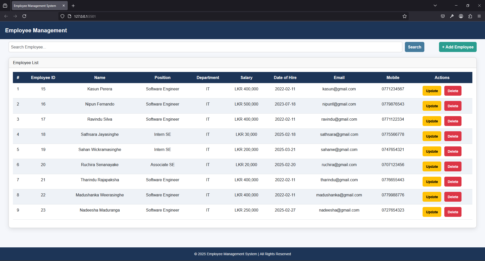
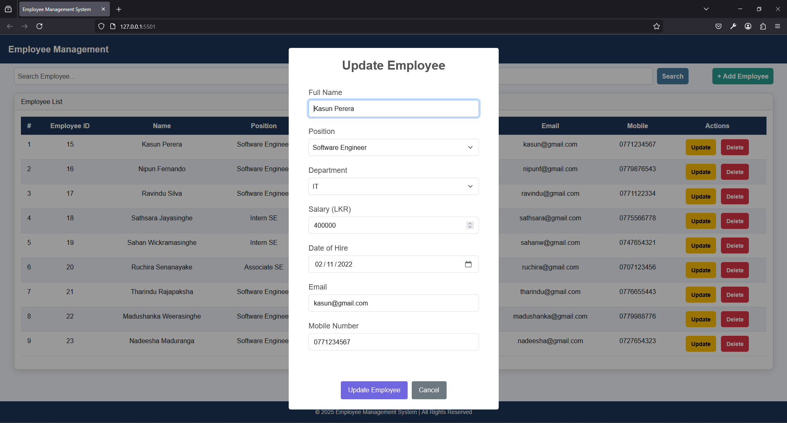

# **Employee Management System**

## **Overview**
The Employee Management System is a web application designed to streamline employee record management. It provides functionalities such as adding, updating, deleting, and searching employees. The system also ensures efficient and secure data handling with a Spring Boot backend and a MySQL database.

---

## **Features**
- **Employee Management**:
  - Add, update, delete, and view employee records.
  - Assign positions and departments to employees.
- **Search & Filter**:
  - Search employees by name, position, or department.
  - Live filtering of employee records.
- **Secure Database Transactions**:
  - Data consistency ensured using Hibernate.
  - Prevents data corruption during operations.

---

## **Technologies Used**
- **Backend**: Spring Boot
- **Database**: MySQL
- **ORM Framework**: Hibernate (JPA)
- **Model Mapping**: ModelMapper
- **Database Connectivity**: MySQL Connector/J
- **Dependency Injection & Lombok**: Spring Boot Starter & Lombok
- **Frontend**: JavaScript (Fetch API)
- **UI Libraries**: Bootstrap, SweetAlert2 for interactive models

---

## **Project Status**
- **In Progress**: Currently under development with additional feature enhancements planned.

---

## **Usage**

### **Employee Management**
1. **Add Employee**:
   - Register new employees with details such as name, position, department, salary, email, and mobile number.
2. **Update Employee**:
   - Modify employee details, including position and salary.
3. **Delete Employee**:
   - Remove employee records from the system.
4. **View Employees**:
   - Display a table of employees with search and filter functionalities.

### **Search & Filtering**
1. **Live Search**:
   - Search employees by name, position, or department.
2. **Filter Data**:
   - Display only relevant employee records based on search criteria.

### **Database Transactions**
- The application ensures secure data storage using Hibernate ORM.
- Prevents inconsistencies by maintaining ACID-compliant transactions.

---

## **Screenshots**

---

## **Contributing**
Contributions are welcome! To contribute to the Employee Management System, fork the repository, make changes, and submit a pull request.

---

## **License**
This project is licensed under the MIT License. If you would like more details, please check the LICENSE file.

---

## **Credits**
- **Developer**: Nipun Basnayake  
- **Special Thanks**: Sharada Marasinghe for valuable guidance and support.  
- **Libraries Used**:
  - Spring Boot for backend services
  - Hibernate (JPA) for database transactions
  - MySQL Connector/J for database connectivity
  - ModelMapper for efficient data mapping
  - Lombok for reducing boilerplate code
  - Bootstrap & SweetAlert2 for UI enhancements

---

## **Contact**
For more details, questions, or contributions, feel free to contact:  
- Email: [nipunsathsara1999@gmail.com](mailto:nipunsathsara1999@gmail.com)  
- GitHub: [NipunBasnayake](https://github.com/NipunBasnayake)

